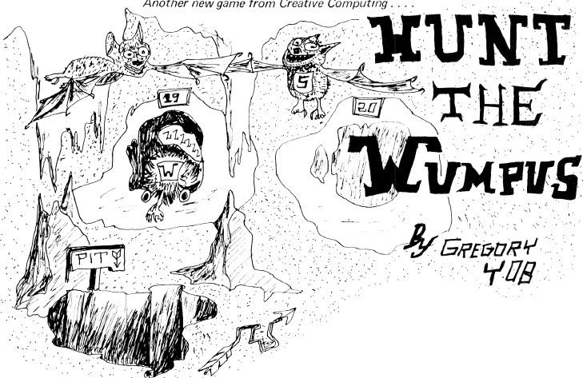

# Hunt the Wumpus

This is a port of the classic BASIC program HUNT THE WUMPUS By GREGORY YOB. I coded this version from scratch but based on the old school BASIC code from *The Best of Creative Computing Volume 1 (published 1976)*. I had the following goals for this project:

- Gently exercise my modern Fortran skills without trying to tackle a massive project.
- Follow the original line-numbered BASIC code as closely as possible, while still using modern Fortran constructs.
- Keep the rules as close as possible to the original version.
- Use one `goto` in the program. ;) 

# Building

To build, you will need `gfortran` and [fpm](https://fpm.fortran-lang.org/). Once installed, build and run:

`fpm run`

The program has only been tested with `gfortran`, but in theory other compilers should work as well. If you try it, let me know!
